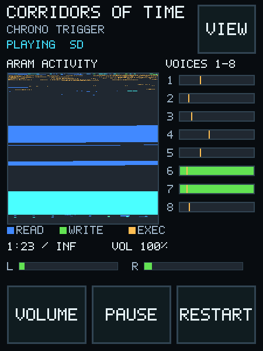
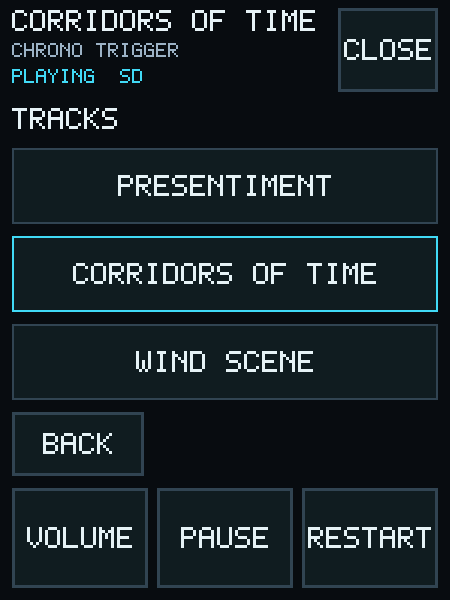
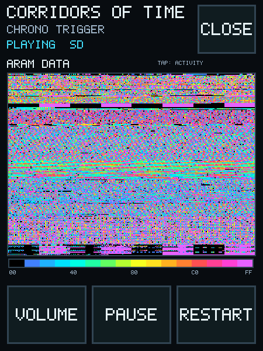

# Pico-SPC-Player

Pico-SPC-Player is a standalone, software-emulated SNES SPC music player for the Waveshare
RP2350 Touch AMOLED 2.41. It plays SPC files from a FAT-formatted microSD card through an
external PCM5102A I2S DAC and presents a finger-operated interface with live ARAM, voice, and
DSP views.

<p align="center">
  
  
  
</p>

## Supported features

The firmware supports software SPC700/S-DSP playback, read-only SD library browsing, touch
controls, and live visualization. Direct control of a physical SPC700 module is not supported.

- 32 kHz stereo output over PIO-driven I2S with DMA buffering
- Read-only FAT12/16/32 library organized as `/game/track.spc`
- ID666 metadata, visible-row title loading, and bidirectional title scrolling
- 450x600 touch UI stored as a 4-bit indexed framebuffer in internal SRAM
- Full-address ARAM Activity and byte-value Data heatmap views
- Live voice summaries, voice details, DSP registers, echo state, and diagnostics

## Required hardware

- Waveshare RP2350 Touch AMOLED 2.41
- PCM5102A I2S DAC module
- Powered speaker, amplifier, or line-level audio input
- FAT-formatted microSD card containing SPC files
- Wiring listed in [Hardware](docs/hardware.md)

## SD card layout

Place each game's SPC files directly inside one root-level folder:

```text
/
├── Chrono Trigger/
│   ├── 01 - A Premonition.spc
│   └── 02 - Chrono Trigger.spc
└── Super Mario World/
    └── Overworld.spc
```

The player does not autoplay. Open **Library**, choose a folder, and choose a track.

## Quick build

The public configuration contains no music and builds without an SPC file:

```sh
cmake -S . -B build -G Ninja -DPICO_SDK_PATH=/path/to/pico-sdk
cmake --build build --target pico_spc_player
```

Copy `build/Pico-SPC-Player.uf2` to the RP2350 BOOTSEL volume.

For a private fallback build, provide a local SPC file at configure time. The file remains
outside version control:

```sh
cmake -S . -B build-embedded -G Ninja \
  -DPICO_SDK_PATH=/path/to/pico-sdk \
  -DPICO_SPC_EMBEDDED_FILE=/absolute/path/to/music.spc
cmake --build build-embedded --target pico_spc_player
```

## Documentation

- [Building and flashing](docs/building.md)
- [Hardware and wiring](docs/hardware.md)
- [User guide](docs/user-guide.md)
- [SNES audio and SPC file overview](docs/snes-audio.md)
- [Architecture and source map](docs/architecture.md)
- [ARAM visualizer](docs/aram-visualizer.md)
- [Troubleshooting](docs/troubleshooting.md)
- [Interface gallery](docs/user-guide.md#interface-gallery)
- [Contributing](CONTRIBUTING.md)

## Licensing

Project-owned code is MIT-licensed. The firmware also contains separately licensed third-party
components, including the LGPL-licensed `snes_spc` emulator. See [LICENSE](LICENSE),
[NOTICE.md](NOTICE.md), and [third_party/manifest.json](third_party/manifest.json). No SPC music
is included or downloaded by this repository.
