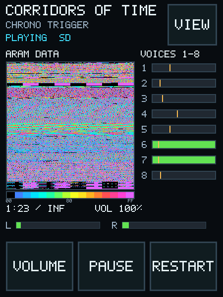

# ARAM visualizer

The compact Player map and dedicated ARAM page each have two modes. Tap either map to switch
between **Activity** and **Data**. Both modes display the complete 64 KiB SPC700 address space.
Address `$HHLL` maps to pixel `(LL, HH)`, placing each 256-byte page on one horizontal row. The
compact map returns to Activity mode when another screen is opened.

| Activity | Data |
| --- | --- |
|  |  |



## Activity mode

The emulator is built with `SPC_ENABLE_ARAM_VISUALIZER=1`. Optional hooks mark:

- SPC700 opcode fetches, data reads/writes, direct-page accesses, and stack accesses;
- S-DSP sample-directory and BRR reads;
- S-DSP echo-buffer reads and enabled echo writes.

Each source sets one bit for the corresponding 16-bit address. The current publication uses blue
for reads, green for writes, yellow for execution, and combined colors for overlaps. An address
with no new event retains a dim history color for one publication before returning to inactive.

Core 0 writes one of two 24 KiB activity banks. It publishes only when the other bank is free,
then immediately attaches the emulator hooks to the cleared replacement bank. Core 1 acquires a
ready bank, converts it into its persistent packed view, and releases it. Neither core waits.

## Data mode

Data mode copies the current ARAM byte values into a separate 32 KiB packed image. Zero is black.
All nonzero values receive an obvious color using this palette-index mapping:

```text
0       -> 0
1..255  -> 1 + (value - 1) / 17
```

This creates 15 evenly sized nonzero ranges while keeping empty/zero-filled areas visually
distinct. The display uses a separate 16-entry RGB565 heatmap palette for the map and scale; UI
text and buttons continue using the normal palette.

A 32 KiB ARAM copy is permitted only when at least two complete audio blocks are buffered. A
mode-request token and playback generation travel with the copy. Core 1 rejects a result after
a mode change or track load.

## Timing and safety

The selected 30 or 60 Hz rate is driven by rendered audio frames rather than wall-clock delay.
Publication is skipped when a consumer still holds the relevant buffer. These drops preserve the
audio deadline and appear in the Settings diagnostics. The hooks and copy functions do not modify
emulated RAM, registers, DSP state, or PCM output.
