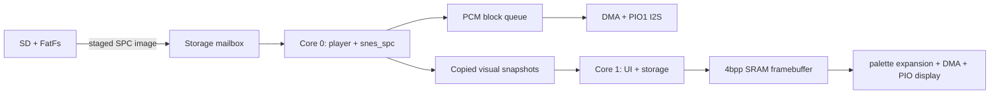

# Architecture

## Source map

| Path | Responsibility |
| --- | --- |
| `src/app/` | Core coordination and runtime services |
| `src/audio/` | PCM format, buffering, and I2S output |
| `src/board/` | RP2350 board initialization and hardware policy |
| `src/display/` | AMOLED transport and indexed-pixel expansion |
| `src/diagnostics/` | Nonblocking UART performance reports |
| `src/player/` | Playback state, fades, and commands |
| `src/spc/` | SPC parsing, metadata, emulator backend, and snapshots |
| `src/storage/` | FAT mounting, catalog scanning, and track staging |
| `src/ui/` | Touch state, layout, pages, drawing, and diagnostics |
| `src/visualizer/` | ARAM activity/data models and publication timing |
| `third_party/` | Vendored sources with their original formatting and licenses |
| `host/`, `tests/` | Host renderer and focused deterministic checks |

## Data flow and core ownership

The RP2350 runs at 250 MHz. Core 0 owns the mutable `snes_spc` backend, its 64 KiB ARAM, playback
state, and PCM production. It renders complete 256-frame blocks into a bounded single-producer,
single-consumer queue. The I2S DMA interrupt is the only consumer. When the queue is empty, the
interrupt supplies silence and records an underrun instead of waiting.

Core 1 owns FatFs, card scanning, touch input, UI state, the indexed framebuffer, and display
transfers. It reads an SPC into a fixed mailbox while the current song continues. Core 0 claims the
ready mailbox between audio blocks, validates and loads the image, and returns an accepted
generation. Core 1 changes the visible metadata only after audio reports that generation.

Visualization is opportunistic. Core 0 publishes copied DSP snapshots and swaps caller-owned ARAM
activity banks without waiting. Core 1 may miss an update when busy. A Data heatmap copies 32 KiB
only when at least two audio blocks are queued. Request and playback-generation tags prevent a
late Activity/Data result or a previous track's result from being displayed.

The UI framebuffer stores two 4-bit palette indexes per byte, requiring 135 KiB for 450x600
pixels. The display module expands indexed pairs through 256-entry RGB565 lookup tables into two
small scanline buffers. DMA and PIO transmit one buffer while Core 1 prepares the next. Startup
checks detect and validate PSRAM. Audio, emulator state, and the framebuffer use internal SRAM.

## Where to make common changes

| Change | Primary location |
| --- | --- |
| UI geometry or touch targets | `src/ui/ui_layout.*` and the relevant page module |
| Shared header and transport behavior | `src/ui/ui.c` |
| Simple View/Track/Settings/Volume rendering | `src/ui/ui_pages.c` |
| Audio sample rate or block size | `src/audio/pcm_format.h` |
| I2S pins and DMA/PIO behavior | `src/audio/i2s_output.c`, `src/audio/i2s_tx.pio` |
| SD pins or card protocol | `src/storage/sd_card.c` |
| Folder, track, path, or image limits | `src/storage/spc_catalog.h` |
| Cross-core UI and visual coordination | `src/app/ui_runtime.*`, `src/app/visual_pipeline.*`, `src/app/visual_consumer.*` |
| Startup clocks and periodic performance logging | `src/board/board.*`, `src/diagnostics/uart_performance.*` |
| Player commands or fade state | `src/player/player_commands.*`, `src/player/player.*` |
| AMOLED palette expansion and transfer timing | `src/display/display.*` |
| Vendored integration | Component under `third_party/`, then `third_party/manifest.json` and `NOTICE.md` |

Public headers describe core/IRQ ownership, blocking behavior, borrowed-buffer lifetime, and units
where those constraints are not evident from the type. Implementation-only helpers remain file
local so the cross-module interface stays small.
