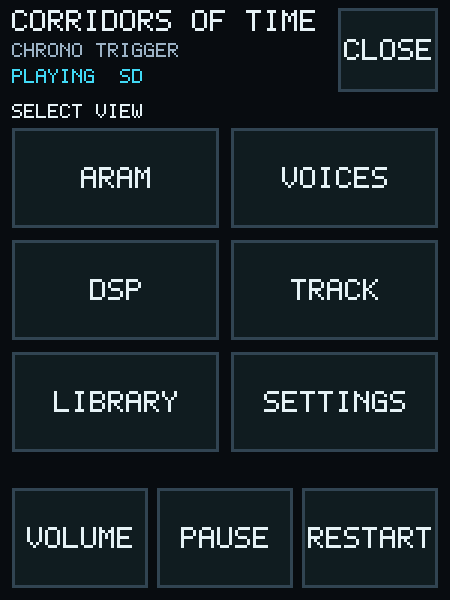
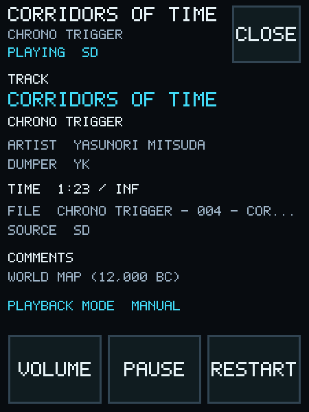
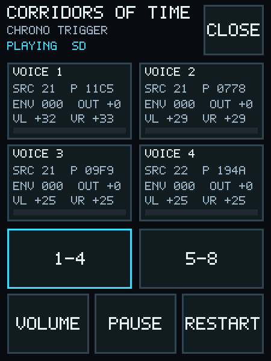
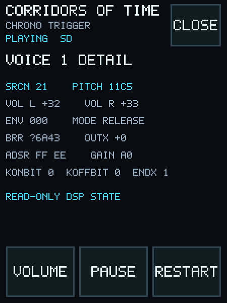
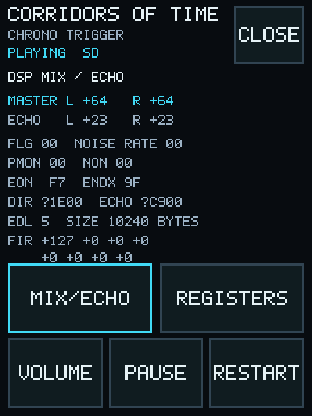
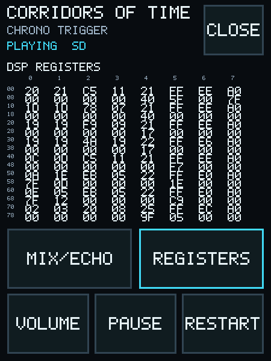
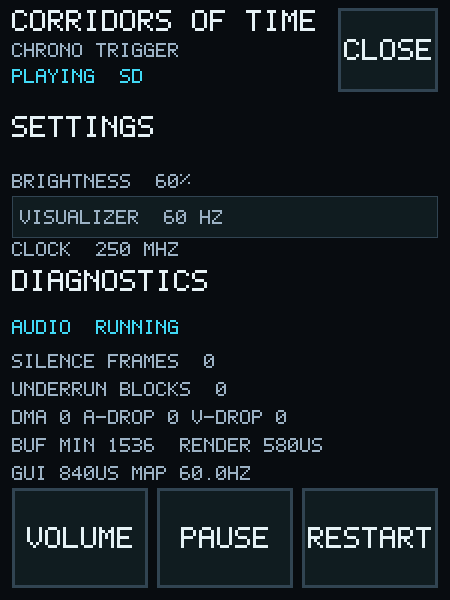
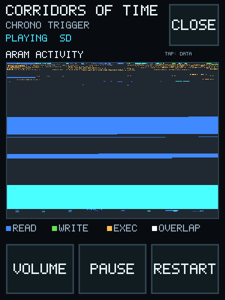

# User guide

## Preparing the card

Create one folder per game at the card root and place SPC files directly in those folders:

```text
/Game Name/Track Name.spc
```

Only one folder level is scanned. Files at the root, nested subfolders, hidden/system entries,
non-SPC files, and files outside the fixed SPC load-size range are ignored. Folder and track lists
are sorted without regard to case.

## Startup and playback

With a readable SD card inserted, the player scans the root folders and waits for a selection. It
does not autoplay the first track. Open **View**, select **Library**, choose a game, and then choose
a track. The three visible track rows load their ID666 titles in the background. A long title
pauses at each end and scrolls back and forth.

Without a detected card, a privately embedded track appears only if the firmware was configured
with `PICO_SPC_EMBEDDED_FILE`. A normal public build instead asks for a card.

Playback continues indefinitely because SPC fade and duration tags are not used to stop tracks.

## Transport controls

- **Volume** opens eight volume steps plus mute. Gain changes use a short ramp.
- **Pause/Play** fades to or from silence. With no track selected, Play opens the Library.
- **Restart** rereads the current SD file or reloads the private embedded image, then fades in.
- **View/Close** opens the view selector or returns to the player dashboard.

A button activates when the touch is released inside the original target. Moving far enough away
from the initial touch cancels the tap.

## Views

- **Player** shows a compact ARAM Activity map, eight voice meters, playback time, volume, and
  stereo levels.
- **ARAM** fills the main content area with all 65,536 addresses. Tap the map to switch between
  Activity and byte-value Data modes. Close returns to the Player view.
- **Voices** shows voices 1-4 or 5-8. Tap a voice card for pitch, envelope, BRR, volume, and DSP
  state details.
- **DSP** switches between decoded mix/echo state and the raw 128-register matrix.
- **Track** shows ID666 title, game, artist, dumper, comments, source file, and elapsed time.
- **Library** browses game folders and tracks with three finger-sized rows plus Back/Prev/Next.
- **Settings** shows clock, visualizer rate, and live diagnostics.

## Interface gallery

| Player dashboard | View selector |
| --- | --- |
|  |  |
| Track library | Track metadata |
|  |  |
| Voice overview | Voice details |
|  |  |
| DSP summary | DSP register matrix |
|  |  |
| Settings and diagnostics | ARAM Activity |
|  |  |

## Visualizer rate

The firmware starts at 60 Hz. Tap the **Visualizer 30 Hz/60 Hz** row in Settings to switch rates.
The selected rate controls snapshot publication and UI model updates. Display transfer time and
available audio headroom can cause visual updates to be dropped; audio remains the priority.

## Settings diagnostics

- **Audio** reports whether I2S DMA started.
- **Silence frames** counts unintentional silent output.
- **Underrun blocks** counts DMA requests that found no queued PCM block.
- **DMA** counts late audio DMA service.
- **A-Drop** counts dropped audio-status snapshots.
- **V-Drop** counts dropped visual snapshots.
- **Buf Min** is the lowest observed number of queued stereo frames.
- **Render** is the longest measured SPC block rendering time in microseconds.
- **GUI** is the longest measured Core 1 work slice in microseconds.
- **Map** is the measured ARAM-map display rate.
